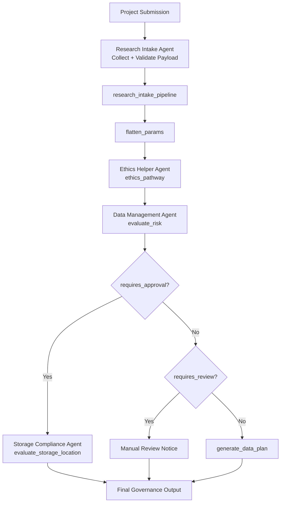
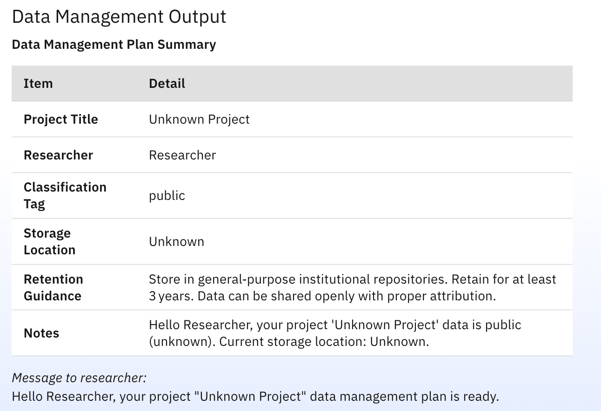

# IBM watsonx Orchestrate – AI Governance Project

This repo implements the **AI Governance use case** (University Research Ethics & AI Advising) with watsonx Orchestrate. It provides a **Research Intake Agent** as the front door, which collects structured project details and orchestrates **sub-agents** to deliver ethics pathway guidance, data management plans, and storage compliance.

This guide covers:
1. **How the Research Intake Agent uses sub-agents and the pipeline** to meet the project requirements.
2. **Decision logic** of each agent.
3. **Tools** used by each agent and what each tool does.

---

## Research Intake Agent: How It Uses Sub-Agents (Guide Alignment)

The Research Intake Agent is the single entry point for researchers. It does **not** make ethics or governance decisions itself. It:

1. **Collects** a structured intake payload (nested JSON: `meta`, `project`, `researcher`, `approver`, `ai`, `data`, `external_collaborators`) with required fields and allowed defaults.
Please check [inputs/example.json](inputs/example.json) as an example.

2. **Validates** that no required field is null or missing before proceeding.
3. **Orchestrates** downstream work in **Pipeline**: Runs the **research_intake_pipeline** flow, which runs `flatten_params` → **Ethics Helper Agent** → **Data Management Agent** in a fixed sequence and returns both outputs.

The same auditable payload is passed through all sub-agents so that ethics routing, risk assessment, data classification, and storage compliance are based on a single source of truth.

---

## Pipeline Flow: `research_intake_pipeline`

When the Research Intake Agent runs the **research_intake_pipeline** tool (flow), the sequence is:



| Step | Component | Role |
|------|------------|------|
| 1 | **flatten_params** (tool) | Maps the nested intake JSON to a flat structure for the ethics tool (e.g. `researcher_name`, `faculty`, `involves_humans`, `participant_type`, `data_sensitivity_level`). |
| 2 | **Ethics Helper Agent** | Receives context from the flow (flattened params and/or intake). Calls **ethics_pathway** once, then returns the tool’s `formatted_report` (and ticket behaviour) as the ethics output. |
| 3 | **Data Management Agent** | Receives the full intake payload. Calls **evaluate_risk**; then, depending on the result, either delegates to **Storage Compliance Agent** or calls **generate_data_plan**. Returns a Markdown summary. |
| 4 | Flow output | Returns `ethics_output` and `data_mgmt_output` for the Research Intake Agent to present to the user. |

So the Research Intake Agent fulfils the guide by: *collecting structured intake → routing through a fixed workflow → Ethics Helper (pathway + checklist + optional ticket) → Data Management (risk, storage compliance, data plan)*.

---

## Agent Decision Logic

### 1. Research Intake Agent (`research_intake_agent.yaml`)

- **Role:** Front-door orchestration only. Collects and validates intake; does not assess ethics or risk.
- **Decision logic:**
  - If any required schema field is missing or null → ask the user for that field (by section: project, researcher, approver, AI, data, collaborators, meta); apply allowed defaults for arrays and external model details only.
  - If `data.human_participants.involves_humans` is true and `data.human_participants.data_details` is empty → ask for participant categories (e.g. students, patients, staff, public) and set `data_details`.
  - Only when the full nested payload is valid → serialize it to a JSON string and either run **research_intake_pipeline** or call **Ethics Helper Agent** then **Data Management Agent** with that string in `message`.
  - Original design note: this agent was planned to also orchestrate **Approval Agent** in the same flow. It is currently deferred because third-party send ticket/email services are not integrated yet.
  - After both ethics and data-management results are back → return **ETHICS_OUTPUT** then **DATA_MGMT_OUTPUT** verbatim; no merging or rewriting.
- **Tools:** `research_intake_pipeline` (flow).
- **Collaborators:** Ethics Helper Agent, Data Management Agent (invoked via collaborator tools with strict `message` = raw JSON string).

---

### 2. Ethics Helper Agent (`ethics_helper_agent.yaml`)

- **Role:** Orchestrate ethics pathway guidance and checklist; never approve or certify ethics.
- **Decision logic:**
  - **Step 1 – Intake confirmation:** Check that `researcher_name`, `researcher_email`, `faculty`, `project_title`, `project_summary`, and `data.human_participants.involves_humans` are present and type-correct. If `involves_humans` is true, ensure `data.human_participants.data_details` exists (array, may be empty). If anything is missing → stop and request the missing field(s) by path; do not call the tool.
  - **Step 2 – Tool invocation:** When intake is complete, call **ethics_pathway** exactly once with the mapped flat parameters (from intake or from the flow’s flattened output).
  - **Step 3 – Output:** Return the tool’s `formatted_report` verbatim.
  - **Step 4 – Ticket:** If the tool returns `ticket_required == true` → treat as create_ticket, assigned_group “Ticket Analyst”, include recommendation_escalation; if `ticket_required == false` → do not create a ticket. Never assign directly to Research Office or HREC.
- **Tools:** `ethics_pathway`.
- **Knowledge base:** `Authoritative_policy_references_8245U3` (policy pack for guidance).

---

### 3. Data Management Agent (`data_management_agent.yaml`)

- **Role:** Evaluate data governance risk and storage; optionally delegate to Storage Compliance; generate a data plan when allowed. Does not approve anything.
- **Decision logic:**
  - **Step 0 – Validation:** Ensure input has `data`, `external_collaborators`, `project`, `researcher` and required nested fields (`project.title`, `researcher.researcher_name`, `researcher.researcher_email`, `data.storage.location`, `data.storage.approved_storage`, `data.sensitivity.level`, `external_collaborators.has_external_collaborators`). Treat `false` as valid. If anything is missing → ask for it and stop.
  - **Step 1 – Risk evaluation:** Call **evaluate_risk** once with the full JSON context.
  - **Step 2 – Precedence:**
    - If **evaluate_risk** returns `requires_approval == true` → delegate to **Storage Compliance Agent** with the same full JSON; present its output as the authoritative storage compliance result; then stop.
    - Else if `requires_review == true` → inform the user that manual review is required (high-sensitivity); do not create tickets; stop.
    - Else (both `requires_approval` and `requires_review` false) → call **generate_data_plan** with `context` and `classification_tag` from **evaluate_risk**; present a Markdown report from the tool output only.
  - **Output:** Human-readable Markdown only; no raw JSON unless the user asks. Do not reword or change decision outcomes.
- **Tools:** `evaluate_risk`, `generate_data_plan`.
- **Collaborators:** Storage Compliance Agent.

---

### 4. Storage Compliance Agent (`storage_compliance_agent.yaml`)

- **Role:** Validate whether the proposed storage location is approved; provide guidance only, no approvals.
- **Decision logic:**
  - **Step 0 – Validation:** Ensure `project.title`, `data.storage.location`, `data.sensitivity.level`, `external_collaborators.has_external_collaborators` exist and are type-correct. If missing → ask and stop.
  - **Step 1 – Tool:** Call **evaluate_storage_location** once with the full composite JSON as `context`.
  - **Step 2 – Output:** Produce a Markdown report with: *Storage Compliance Status* (project title, current location, approved/not approved), *Approved Storage Locations* (from `location_matrix`), and *Guidance Message* using the tool’s message semantics (approved vs not approved). No JSON or code blocks in the reply.
- **Tools:** `evaluate_storage_location`.

---

### 5. Approval Agent (`approval_agent.yaml`)

- **Role:** Coordinate governance approval request submission and send approval emails after complete inputs are provided. It does not make approval decisions.
- **Decision logic:**
  - **Step 0 - Identity first:** At conversation start, require user name. If missing, ask for it and stop. When name is provided, call `hello_user` and use the tool output as the greeting.
  - **Step 1 - Required fields:** Collect and confirm all 6 required values before tool execution: `project_title`, `researcher_name`, `approver_name`, `approver_email`, `approver_brief`, `risk_summary`.
  - **Step 2 - Validation gates:** Do not assume critical values. Reject self-approval (approver cannot be the researcher). Validate email format. If `approver_brief` or `risk_summary` is too short or meaningless, ask for a detailed version and stop.
  - **Step 3 - Tool execution:** Only after all required fields pass validation, call `SendApprovalRequestEmail`.
  - **Step 4 - Output rule:** Return the approval tool response verbatim with no rewriting.
- **Tools:** `SendApprovalRequestEmail`, `hello_user`.

---

## Tools Reference (Used by the Agents Above)

| Tool | Used by | Purpose |
|------|---------|--------|
| **flatten_params** | Flow (research_intake_pipeline) | Maps nested intake payload to flat arguments for the ethics pathway: `researcher_name`, `researcher_email`, `faculty`, `project_title`, `project_summary`, `involves_humans`, `participant_type`, `data_sensitivity_level`. Used so the Ethics Helper (or ethics_pathway) can be called with a simple parameter set. |
| **ethics_pathway** | Ethics Helper Agent | **Single source of truth** for ethics routing, risk assessment, checklist, and optional ticket. Inputs: researcher name/email, faculty, project title/summary, involves_humans, participant_type, data_sensitivity_level. **Logic:** (1) If human participants involved → create_ticket true, assign “Ticket Analyst”. (2) Risk: no humans → Low; humans + sensitivity/keywords (e.g. high, health, medical) or vulnerable groups (patients, children, minors) → High; else Medium. (3) Build checklist (consent, storage, withdrawal, privacy; extra items for vulnerable groups). (4) If ticket created and risk is High → recommendation_escalation “HREC”, else “Research Office (Low-risk)”. Returns: ethics_routing, risk_assessment, checklist, create_ticket, ticket (with fields), note, formatted_report. |
| **evaluate_risk** | Data Management Agent | Evaluates governance risk and classification from composite JSON (`data`, `external_collaborators`, `project`, `researcher`). **Logic:** (1) If `data.storage.approved_storage` is false → requires_approval true. (2) If sensitivity is “high” → requires_review true, classification_tag “restricted”, return. (3) Else sensitivity medium → “confidential”, low → “public”. (4) If human participants and sensitivity not low → “restricted”, requires_review true. (5) If data_types include “genomic” or “special” → “restricted”, requires_review true. Returns: requires_approval, requires_review, classification_tag. |
| **evaluate_storage_location** | Storage Compliance Agent | Checks if current storage is approved by sensitivity and external collaborators. **Logic:** Uses a policy matrix (low/medium/high × external yes/no) to get approved locations; compares `data.storage.location` to that list (case-insensitive). Returns: is_approved, current_location, location_matrix (approved list), message (guidance string). |
| **generate_data_plan** | Data Management Agent | Builds a data management plan summary from context and classification_tag. **Logic:** Derives retention policy and notes from tag (restricted / confidential / public); optionally sets manual_review_required from context (e.g. restricted, high sensitivity, external collaborators). Returns: classification_tag, storage_location, project_title, researcher_name, retention_policy, notes, manual_review_required, manual_review_reason, user_message (ready-to-print). |

---

## Prerequisites

Before you start, make sure you have:

- **Python 3.11 ~ 3.13**
- Access to an **IBM watsonx Orchestrate** tenant (Developer Edition or SaaS)

---

## 1. Install the Orchestrate ADK

The ADK is distributed as a Python package and includes both:
- A Python SDK
- A command-line interface (CLI)

Install it using `pip`:

```bash
pip install ibm-watsonx-orchestrate-adk
```

---

## 2. Start production environment

For **remote (production)** watsonx Orchestrate hosted on IBM Cloud, AWS, or on-premises, add an environment and activate it so CLI commands target that instance.

### 2.1 Add the production environment

```bash
orchestrate env add -n <environment-name> -u <your-instance-url>
```

- `<environment-name>`: Any name you prefer for this environment.
- `<your-instance-url>`: Your watsonx Orchestrate service instance URL (see [Getting credentials for your environments](https://developer.watson-orchestrate.ibm.com/environment/initiate_environment)).

Optional: activate right after adding with `--activate`:

```bash
orchestrate env add -n <environment-name> -u <your-instance-url> --activate
```

### 2.2 Activate the production environment

Activate to authenticate and point all commands (except `orchestrate server` and `orchestrate chat`) at that environment.

**Interactive (prompt for API key):**

```bash
orchestrate env activate <environment-name>
# When prompted: Please enter WXO API key: <your-api-key>
```

**Non-interactive (e.g. for scripts):**

```bash
orchestrate env activate <environment-name> --api-key <your-api-key>
```

> **Note:** Remote environment authentication expires every 2 hours. Run `orchestrate env activate` again after it expires.

### 2.3 Check and manage environments

List environments (the active one is marked `(active)`):

```bash
orchestrate env list
```

Remove an environment:

```bash
orchestrate env remove -n <environment-name>
```

---

## 3. Import and export agents to YAML

Use the CLI to move agent definitions between your watsonx Orchestrate environment and local YAML files.

### 3.1 Import an agent from YAML

Import an agent definition from a YAML file into the active environment:

```bash
orchestrate agents import -f agents/main_agent.yaml
```

- `-f` / `--file`: Path to the agent YAML file (e.g. `agents/main_agent.yaml`).

You can also import tools and flows from Python files:

```bash
orchestrate tools import -k python -f tools/generate_data_plan.py
orchestrate tools import -k flow -f flows/research_intake_pipeline_flow.py
```

### 3.2 Export an agent to YAML

Export an existing agent from the environment to a local YAML file:

```bash
orchestrate agents export -n "Main_Agent_4042hW" -k native --agent-only -o main_agent.yaml
```

- `-n` / `--name`: Agent name as shown in the Agents table in watsonx Orchestrate (e.g. `Main_Agent_4042hW`).
- `-k native`: Export format; `native` uses the standard agent YAML structure.
- `--agent-only`: Export only the agent definition (no extra assets).
- `-o` / `--output`: Output file path (e.g. `main_agent.yaml`).

To find an agent’s name or ID, use the Agents list in the watsonx Orchestrate UI or `orchestrate agents list` in the CLI.

---

## Known Issues

- `generate_data_plan.py` may fail to read the correct project title (falling back to `Unknown Project` in some runs).
- Current suspicion is that `agents/data_management_agent.yaml` input is being altered/truncated before it is passed to `generate_data_plan`.
- This has been investigated with multiple fixes attempted, but the root cause has not been fully resolved yet.

---

## Project layout (agents & tools)

| Path | Description |
|------|-------------|
| `agents/research_intake_agent.yaml` | Front-door Research Intake Agent; uses flow + collaborators. |
| `agents/ethics_helper_agent.yaml` | Ethics Helper Agent; calls `ethics_pathway`. |
| `agents/data_management_agent.yaml` | Data Management Agent; calls `evaluate_risk`, `generate_data_plan`; delegates to Storage Compliance. |
| `agents/storage_compliance_agent.yaml` | Storage Compliance Agent; calls `evaluate_storage_location`. |
| `flows/research_intake_pipeline_flow.py` | Flow definition: flatten_params → ethics_helper → data_management. |
| `tools/flatten_params.py` | Flattens nested intake for ethics_pathway. |
| `tools/ethics_pathway.py` | Ethics routing, risk, checklist, optional ticket. |
| `tools/evaluate_risk.py` | Governance risk and classification. |
| `tools/evaluate_storage_location.py` | Storage approval vs policy matrix. |
| `tools/generate_data_plan.py` | Data management plan and retention guidance. |

---

**Reference:** [Configure access to remote environments](https://developer.watson-orchestrate.ibm.com/)
